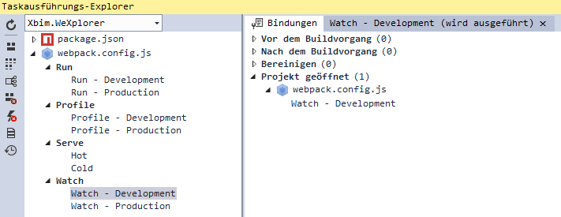

# Using Webpack in XbimWebUI

## Required Extension

Since this project uses webpack to generate the output bundles, the Visual Studio
[WebPack Task Runner Extension](https://marketplace.visualstudio.com/items?itemName=MadsKristensen.WebPackTaskRunner)
extension should be installed.

## Debugging

The `webpack.config.js` file has a binding defined that launches the `Watch - Development` task after the solution has been loaded.
This keeps track of changes to the TypeScript files and rebuilds the `Build/xbim.bundle.js` and the `Build/xbim.browser.css` output files.
A refresh of the page in the browser will load the new bundle.

``` Javascript
/// <binding ProjectOpened='Watch - Development' />
var webpack = require('webpack');
...
```

Tasks can be manually started in the `Task Runner Explorer` window:



## Publishing

When building the solution in the `Release` configuration, the `build.bat` script is being executed. It generates all JavaScript outputs
(complete bundle and separate Viewer and Browser bundles) as well as the documentation.
